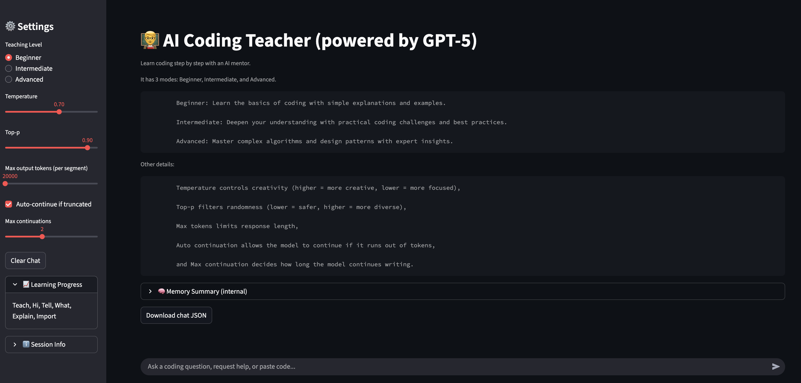

Brief: Below is the complete `readme.md` file content.

```markdown
# AI Coding Teacher

An interactive Streamlit app that acts as a patient, Socratic AI mentor for learning programming. It adapts depth by level, explains pasted code, suggests improvements, generates exercises, tracks topical progress, summarizes long chats, streams responses, and auto‑continues when truncated.

---

## 🚀 Features

- Teaching modes: Beginner / Intermediate / Advanced (adaptive tone & depth)
- Code detection → explanation, issues, refactors, practice task
- Periodic conversation summarization to preserve context window
- Streaming responses with live typing effect
- Auto continuation when reply hits token limit
- Adjustable generation controls (temperature, top‑p, max output tokens, max continuations)
- Lightweight topic progress tracking
- Token budget estimation (optional `tiktoken`)
- Download full chat history as JSON
- Safe context management with buffer

---

## 🧱 Tech Stack

| Layer | Tools |
|-------|-------|
| UI | Streamlit |
| Model API | OpenAI‑compatible endpoint (`openai` Python client) |
| Language | Python 3.10+ |
| Optional | `tiktoken` for token counting |

---

## 📁 Project Structure

app.py          Main Streamlit application
utils.py        Chat history init + export helpers
requirements.txt Dependencies
progress.json   Created at runtime (topics)
screenshots/    (Add your images)
```
---

## 🔑 Environment Configuration

To run this app, you need an API key from "aimlapi.com".
Set your API key (choose one method):

Shell:
```bash
export OPENAI_API_KEY="sk-your-key"
```

Or Streamlit secrets (`.streamlit/secrets.toml`):
```toml
AIML_API_KEY = "sk-your-key"
```
Then in `app.py` either keep `os.getenv("OPENAI_API_KEY")` or switch to `st.secrets["AIML_API_KEY"]`.

---

## 🛠 Installation

```bash
git clone https://github.com/Subhan-2004/AI-Coding-Teacher.git
cd <your-repo-folder>
python -m venv .venv
source .venv/bin/activate  # Windows: .venv\Scripts\activate
pip install -r requirements.txt
streamlit run app.py
```

Open the displayed local URL.

---

## 🧪 Controls (Sidebar)

| Control | What it does |
|---------|--------------|
| Teaching Level | Adjusts explanation style & complexity |
| Temperature | Higher ⇒ more creative; lower ⇒ deterministic |
| Top‑p | Nucleus sampling: limits token pool probability mass |
| Max output tokens (per segment) | Upper bound for a single generation segment |
| Auto‑continue if truncated | Automatically issues follow‑up when finish reason is `length` |
| Max continuations | Maximum chained follow‑ups after the first segment |
| Clear Chat | Resets history & summary (frees context) |

---

## 🔍 Parameter Cheat Sheet

- Temperature: 0.0–0.3 precise / 0.4–0.7 balanced / 0.8+ exploratory
- Top‑p: Lower (e.g. 0.7) constrains variety; 0.9+ broadens
- Max output tokens: Keep ≤ ~25% of remaining context for safety
- Continuations: Use 1–2 for long multi‑section explanations

---

## 🧠 How Long Replies Work

1. Estimate prompt tokens.
2. Compute remaining context = `MODEL_CONTEXT - prompt_tokens - SAFETY_BUFFER`.
3. Clamp requested max output tokens to that remaining space.
4. If model stops with `length` and auto‑continue is enabled, send a “Continue…” message until:
   - Non‑length finish reason, or
   - Continuation limit reached.

---

## 💾 Chat Export

Use the “Download chat JSON” button to save all user/assistant turns (excluding internal system prompts and summaries).

---

## 📝 Screenshot




---

## 🔧 Customization Ideas

- Add model selector
- Per‑topic difficulty tracking
- Database persistence (multi‑user)
- Authentication layer
- Inline code execution sandbox
- Test generation for pasted functions

---

## ⚖ Token & Cost Tips

- Clear chat after large code audits to reclaim context
- Lower temperature + moderate top‑p for instructional clarity
- Avoid extremely high per‑segment token caps (model context still limits)

---

## 🐛 Troubleshooting

| Symptom | Likely Cause | Fix |
|---------|--------------|-----|
| Empty response | Bad API key | Reset environment / secrets |
| Truncated answer | Context exhausted | Clear chat or reduce history |
| Slow generation start | Large prompt | Summarize / clear older turns |
| Inaccurate token estimate | Missing `tiktoken` | Install `tiktoken` |

---

## 🔐 Security

Never commit real API keys. Use environment variables or secrets management.

---

## 🙏 Acknowledgments

Inspired by interactive tutoring patterns, prompt engineering workflows, and iterative learning design.

---

## ✅ Quick Start (TL;DR)

```bash
pip install -r requirements.txt
export OPENAI_API_KEY="sk-your-key"
streamlit run app.py
```
Ask a question or paste code. Adjust sliders. Download chat when done.

